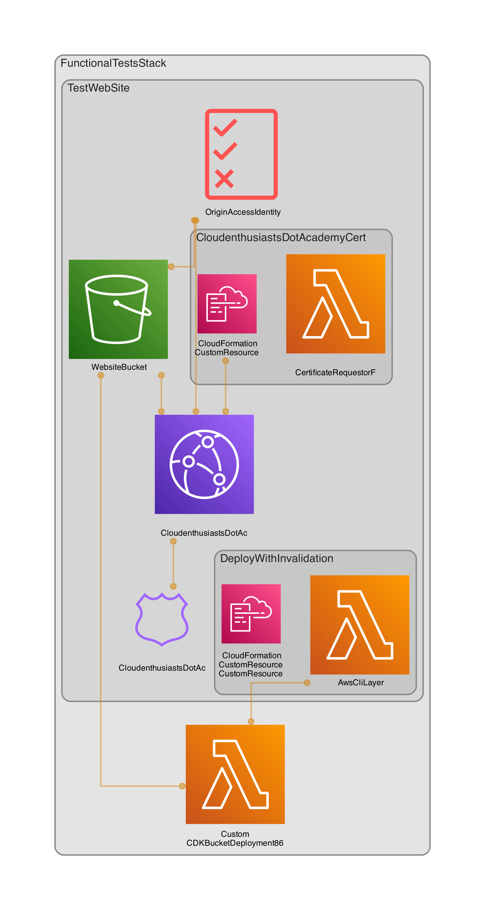

# XLER8R Patterns Lite Functional Tests

This package contains functional tests for the constructs in package (@cre8ivelogix/xler8r-lite).

The `cdk.json` file tells the CDK Toolkit how to execute your app. In our case the entry point is bin/functional-tests.ts file

## Useful commands for functional testing.

Goto directory @cre8ivelogix/functional-tests and execute the following command.

To run the functional tests use the following command
* `./functional-tests ACCOUNT_ID REGION DOMAIN_NAME`

where ACCOUNT_ID and the REGION is where you want to deploy the stack and should have credentials configured with 
sufficient privileges. DOMAIN_NAME is the domain name for the website and should have a Route53 HostedZone configured 
in that account.

The functional tests will deploy the following architecture.

